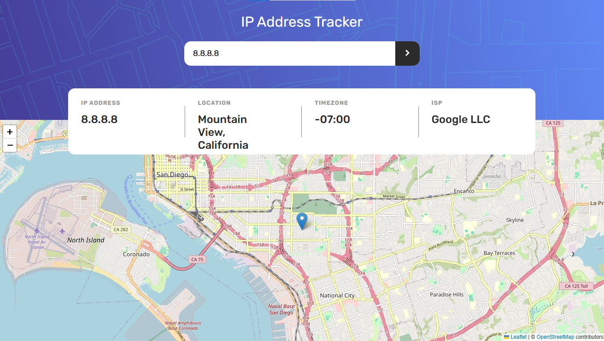
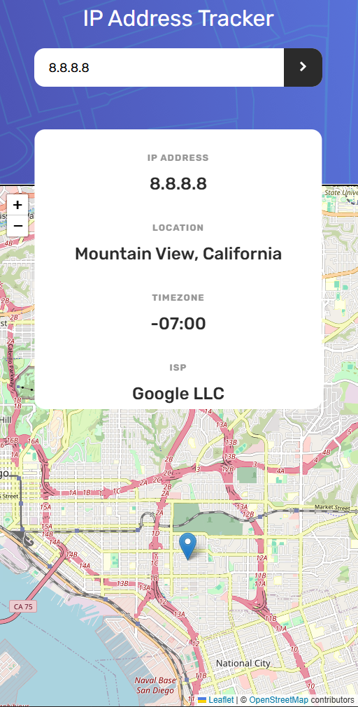

# 🌐 IP Address Tracker

A responsive and interactive IP Address Tracker built with **React + Vite**, using **LeafletJS** for map visualization and the **IPify Geolocation API** for fetching IP and domain information.

## 🔍 Features

-   🌎 **Automatic Location Detection**: Displays your IP address and location on first load.
-   🔎 **Search Functionality**: Look up any IP address or domain and view key details.
-   🗺️ **Interactive Map**: Integrated with LeafletJS to display exact geolocation.
-   📱 **Responsive Design**: Optimized for desktop, tablet, and mobile views.

## ⚠️ API Usage Notice

This project uses the **free tier** of the [IPify Geolocation API](https://geo.ipify.org/), which includes a **limit of 1,000 GET requests per month**.

> **⚠️ Important:** If you or others exceed this request limit, the app will stop working properly — you won’t receive location data, and the map won't update.

Please avoid excessive testing or reloading to conserve the request quota.

---

## 🛠️ Tech Stack

-   **React** (via [Vite](https://vitejs.dev/)) – fast development environment
-   **LeafletJS** – for rendering dynamic maps
-   **IPify API** – for geolocation data
-   **SCSS** - for style

---

## 🚀 Getting Started

```bash
# 1. Clone the repository
git clone https://github.com/yourusername/ip-address-tracker.git

# 2. Navigate into the project folder and install dependencies
cd ip-address-tracker
npm install

# 3. Set up your environment
# Create a .env file in the root directory and add your API key:
echo "VITE_API_KEY=your_api_key_here" > .env

# 4. Start the development server
npm run dev
```

## 🖼️ Screenshots

<p align="center">
    
    
</p>

## 🌍 Live Demo

Check out the live version of the project here:  
[Live Demo](https://clinquant-mandazi-fae822.netlify.app/)
